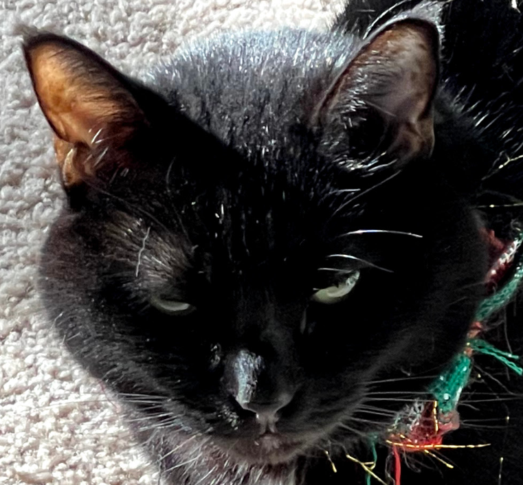

# BeanieTheCat Hooking Library
A filthy little hooker library for x86 32/64 named after the one and only Beanie.




## What Works
Linux Binaries of the x86 variety - 32 and 64bit supported.

# What needs testing and makefile entries
Windows - I'll likely backport this when I have a sec.

## How Does it Work?

Simple interface:

```c
void* flh_inline_hook(const char* module_name, const char* function_name, void* redirect_function_address);
int flh_inline_unhook(void* target_address);
```

Essentially, specify a module name (or NULL for your process) and a function name along with your hook address and the hooker gets to work:

1. It supports both relative and absolute inline hooks with proper auto-padding thanks to capstone.

2. It creates a nearby page that supports multiple chained hooks seamlessly.

3. The hook function returns a "real_function" address you can use to call the orginal function from a supported trampoline - now with relative rebasing support!!!

4. Chain multiple hooks together by calling flh_inline_hook multiple times with various functions.

5. Supported handling to deal with CET calls (via not executing them in the trampoline, we'll see how reliable this is).

Unhooking is as easy as giving flh_inline_unhook the address of the function you want restored.


